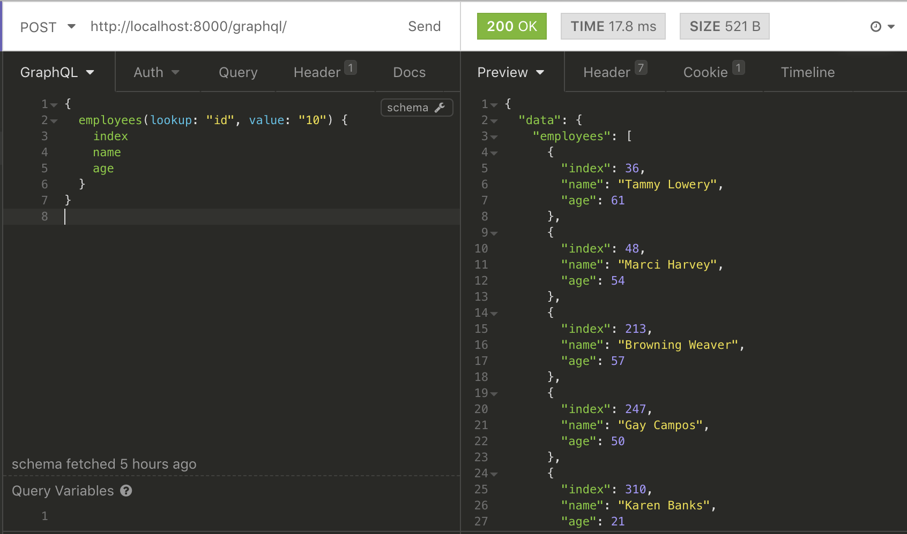

# Paranuara Challenge Implementation

## Prerequisites

This project has the following dependencies:

- docker-compose
- MongoDB (This is specifically to support the import of data to the DB using the mongoimport command)

## Installing

### Load the database and run the project

The following command sets up the project to run the docker files and loads the database with the data in the resources folder.

```bash
sh manage-server.sh loadnrun
```

You can replace the files in the resources folder to import a different data set.

### Run the project without a data load

```bash
sh manage-server.sh run
```

## Running the tests

You can use the following command to run the tests:

```bash
sh manage-server.sh test
```

The project also has a CI pipeline setup on [Travis CI](https://travis-ci.org/rohitjose/paranuara-api).

## API Usage

The app is implemented in GraphQL with the graphene-django library. The APIs are accessible at the endpoint with a POST request.

```
http://localhost:8000/graphql/
```

### Return company employees

The API can perform a lookup either based on the company's index or the name. It takes in two arguments:

- lookup - Can have a value of 'id' or 'name' and denotes the lookup operation to be performed by the API
- value - The value for the lookup

##### Sample request

**Lookup by id**

```js
{
  employees(lookup: "id", value: "10") {
    name,
    age,
    phone
  }
}
```

**Lookup by name**

```js
{
  employees(lookup: "name", value: "TECHTRIX") {
    name
    age
    phone
  }
}
```


### Return common friends

The API accepts a list of index values of the people and returns list of their friends in common which have brown eyes and are still alive. This is the default behavior of the API, however, the API accepts additional parameters:

- eyeColor - Accepts a string input and filters based on the eye colour provided.
- hasDied - Accepts a boolean input.

##### Sample request

**For the specified requirement**

```js
{
  commonFriends(id: [30,50]) {
    name,
    age,
    address,
    phone
    
  }
}
```

**With additional arguments**

```js
{
  commonFriends(id: [30,50,300,500], eyeColor:"blue", hasDied: true) {
    name,
    age,
    address,
    phone,
    balance,
    email
  }
}
```


### Return favourite food

The API accepts the person's index value as arguments and returns the favorite food.

##### Sample request

```js
{
  favouriteFood(id:10){
    username,
    age,
    fruits,
    vegetables
  }
}
```


#### Sample output

**Employees**




**Common Friends**


**Favorite food**


### Built With

- Django
- MongoDB
- graphene-django
- graphene-mongo
- Docker